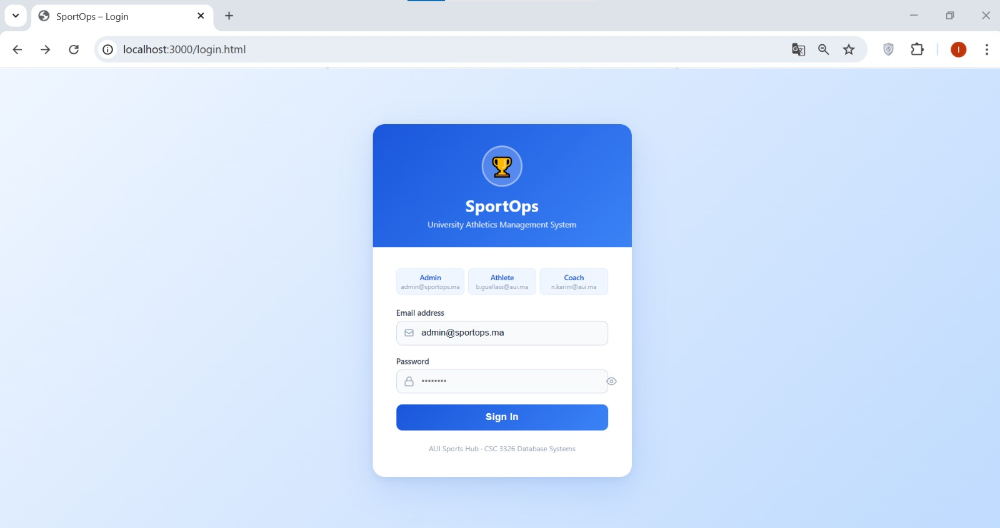
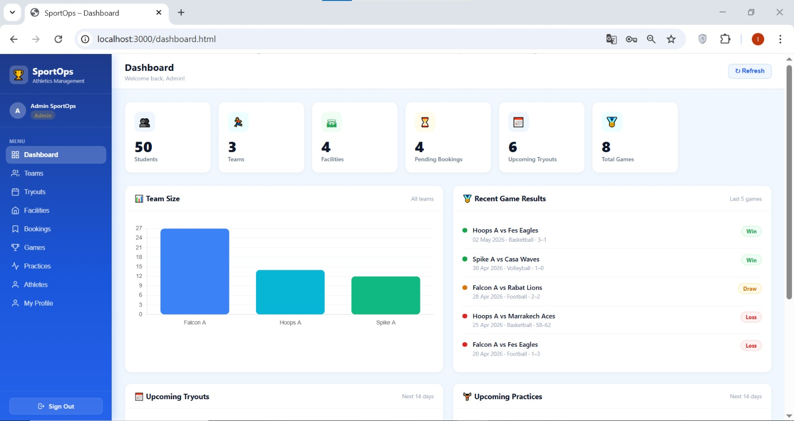
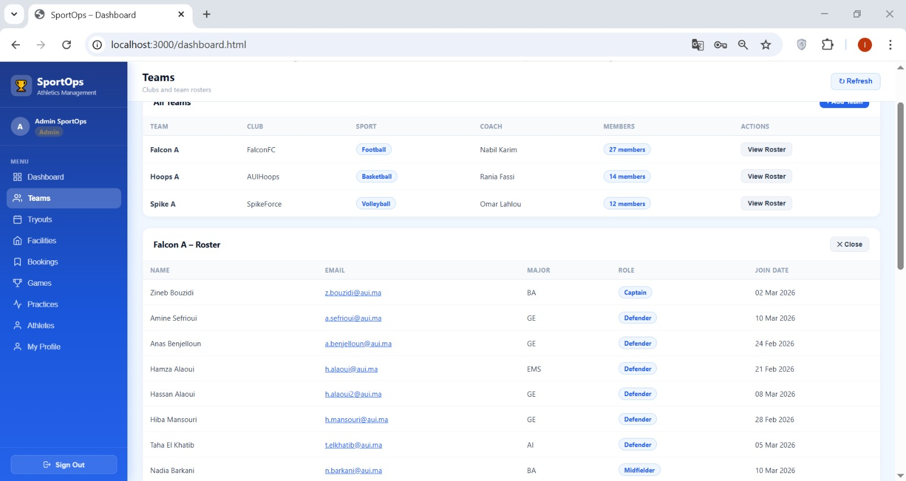

# 🏆 SportOps – University Athletics Management System

SportOps is a full-stack web application designed to manage university sports activities, including teams, students, coaches, facilities, bookings, tryouts, practices, and games.

It provides a centralized platform for administrators, coaches, and students to efficiently organize and track sports operations within a university environment.

---

## 🚀 Features

### 👨‍💼 Admin Dashboard
- Real-time statistics (students, teams, facilities, bookings)
- Manage clubs, teams, coaches, and students
- Monitor tryouts and practice sessions
- View game results and performance analytics
- Approve or reject facility bookings

### 🧑‍🎓 Student Module
- Join multiple sports teams (cross-sport participation supported)
- Register for tryouts
- View practice schedules and facility availability
- Track personal performance and participation history

### 🏋️ Coach Module
- Manage assigned teams and rosters
- Create practice sessions and tryouts
- Track attendance and player performance
- Request facility bookings

### 🏟 Facility Management
- Book sports facilities
- View availability schedules
- Handle booking conflicts
- Admin approval workflow

### 🏅 Sports Operations
- Match scheduling system
- Score tracking and results history
- Team performance overview
- Multi-sport competition support

---
📸 Screenshots

A quick overview of the SportOps system across different user roles and core modules.

🔐 Authentication System

Users log in based on their role (Admin, Coach, Athlete).

  

📊 Admin Dashboard

Central control panel with real-time statistics, system overview, and management tools.

  

🏋️ Coach Dashboard

Team management interface for coaches to organize training, tryouts, and players.

  

👥 Teams & Memberships

Displays team rosters, roles, and student participation across multiple sports.

  

🏟 Facility Booking System

Facility reservation system with approval workflow (Pending / Approved / Rejected).

  

## 🧱 Tech Stack

### 💻 Frontend
- HTML5
- CSS3
- JavaScript (Vanilla)
- Chart.js (Analytics dashboards)

### ⚙️ Backend
- Node.js
- Express.js
- RESTful API architecture

### 🗄 Database
- PostgreSQL
- Relational schema design
- Foreign keys & normalization (3NF)

### 🔐 Authentication & Security
- JWT (JSON Web Tokens)
- bcrypt password hashing
- Role-based access control (RBAC)

---

## 📊 Database Structure

Main entities:
- Students
- Coaches
- Clubs
- Teams
- Facilities
- Tryouts
- Practice Sessions
- Games
- Memberships (many-to-many: students ↔ teams)
- Facility Bookings
- Users (authentication system)

---

## 🔐 Authentication System

- Role-based access control:
  - Admin
  - Coach
  - Athlete (Student)

- Secure authentication:
  - Password hashing (bcrypt)
  - Token-based session management (JWT)
  - Protected API routes

---

## 🧪 Key Features Implemented

- Multi-team membership per student
- Cross-sport participation allowed
- Real-time dashboard statistics
- Automated facility booking system
- Full relational database integration
- Role-specific dashboards (Admin / Coach / Athlete)

---
## 📌 Future Improvements

- React frontend migration
- Real-time notifications system
- Live chat between coaches and athletes
- Advanced analytics with AI predictions

---
## 👥 Team Members

This project was developed by:

- Badreddine Guellass  
- Ikram El Brouzi  
- Nada El Yassenasni  
- Nora Barakat  
- Wiam Alaoui Hachimi  

## 📜 License

This project is developed for academic purposes as part of CSC 3326 – Database Systems.
